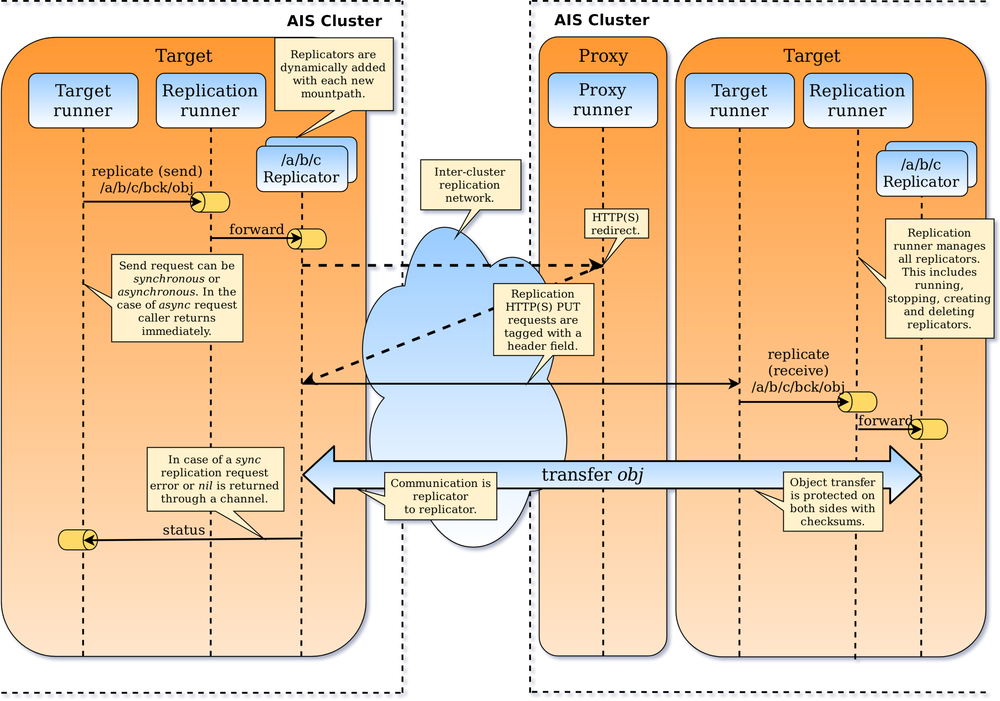

## Table of Contents
- [Experimental](#experimental)
	- [WebDAV](#webdav)
	- [Multi-tiering](#multi-tiering)
	- [Inter-cluster replication](#inter-cluster-replication)
	- [Authentication](#authentication)

## Experimental

There are features, capabilities and modules that we designate as _experimental_ - not ready yet for deployment and usage. Some of those might be eventually removed from the product, others - completed and stabilized. This section contains a partial list.

### WebDAV

WebDAV aka "Web Distributed Authoring and Versioning" is the IETF standard that defines HTTP extension for collaborative file management and editing. AIStore WebDAV server is a reverse proxy (with interoperable WebDAV on the front and AIStore's RESTful interface on the back) that can be used with any of the popular [WebDAV-compliant clients](https://en.wikipedia.org/wiki/Comparison_of_WebDAV_software).

For information on how to run it and details, please refer to the [WebDAV README](../webdav/README.md).

### Multi-tiering

AIStore can be deployed with multiple consecutive AIStore clusters aka "tiers" sitting behind a primary tier. This provides the option to use a multi-level cache architecture.


Tiering is configured at the bucket level by setting bucket properties, for example:

```shell
$ curl -i -X PUT -H 'Content-Type: application/json' -d '{"action":"setprops", "value": {"next_tier_url": "http://localhost:8082", "read_policy": "cloud", "write_policy": "next_tier"}}' 'http://localhost:8080/v1/buckets/<bucket-name>'
```

The following fields are used to configure multi-tiering:

* `next_tier_url`: an absolute URI corresponding to the primary proxy of the next tier configured for the bucket specified
* `read_policy`: `"next_tier"` or `"cloud"` (defaults to `"next_tier"` if not set)
* `write_policy`: `"next_tier"` or `"cloud"` (defaults to `"cloud"` if not set)

For the `"next_tier"` policy, a tier will read or write to the next tier specified by the `next_tier_url` field. On failure, it will read or write to the cloud (aka AWS or GCP).

For the `"cloud"` policy, a tier will read or write to the cloud (aka AWS or GCP) directly from that tier.

Currently, the endpoints which support multi-tier policies are the following:

* GET /v1/objects/bucket-name/object-name
* PUT /v1/objects/bucket-name/object-name

### Inter-cluster replication

Object replication (service) sends and receives objects via HTTP(S). Each replicating worker (aka _replicator_) is associated with a single configured local filesystem and is tasked with queuing and subsequent FIFO processing of *replication requests*. To isolate the, potentially, massive replication traffic from all other intra- and inter-cluster workloads, the service can be configured to utilize a separate network. Replication transfers themselves are end-to-end protected by checksums.

The picture below illustrates some of the aspects of replication service as far as its design and data flows.



**Note:** The service is currently in its prototype stage and is not yet available.


### Authentication

Please see [AuthN documentation](../authn/README.md).

### Downloader

AIS supports downloading files directly onto AIS from external servers using its Download endpoint. This feature is useful for getting large data sets onto AIS, and having AIS worry about managing the process of downloading. The download endpoint (which is only accessible through a AIS proxy) accepts the following types of requests: Download (POST), Cancel (DELETE) and Status(GET).

All types of download requests are issued to Downloader (a goroutine), which is an extended action that starts up whenever there is traffic to AIS's download endpoints. The goroutine is alive until all download endpoint requests are handled or as long as more download requests are incoming. After a brief period of inactivity, the goroutine will self-terminate.

AIS's Downloader dispatches each download request to the request's corresponding mountpath jogger, which will process and handle the request accordingly. To learn more about AIS's Downloader and how to use its endpoints, refer to the Downloader [README](downloader/README.md). In the README, you'll also find details about AIS's multi and list download operations, which are useful to download multiple objects easily. In the `downloader` package [folder](downloader/), you will also find sample scripts to upload very large machine learning datasets to AIS easily that utilize AIS's download endpoints.

### Replication

Object replication (service) sends and receives objects via HTTP(S). Each replicating worker (aka _replicator_) is associated with a single configured local filesystem and is tasked with queuing and subsequent FIFO processing of *replication requests*. To isolate the, potentially, massive replication traffic from all other intra- and inter-cluster workloads, the service can be configured to utilize a separate network. Replication transfers themselves are end-to-end protected by checksums.

The picture below illustrates some of the aspects of replication service as far as its design and data flows.


